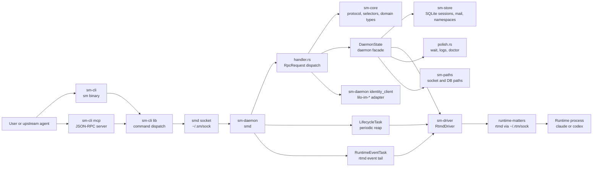
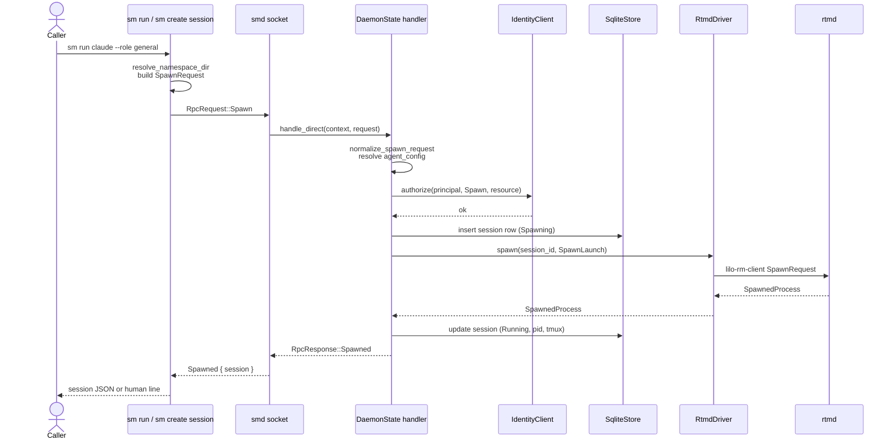
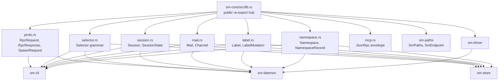

# session-matters Codebase Map

This map is for agents onboarding into `session-matters`.

Basis: current fmm MCP index, 110 indexed files, ~17,866 LOC. Source files under `crates/*/src` total ~11,505 LOC; integration tests under `crates/*/tests` total ~6,361 LOC. Package names and crate dependency names were checked with Cargo metadata because fmm indexes source, not package manifests.

## Architecture Diagram



## Spawn Sequence Diagram



## Contract Dependency Diagram



## System Shape

```text
sm CLI
  -> RpcRequest tagged JSON over UnixSocket (~/.sm/sock)
    -> smd accept loop in sm-daemon::server::run_daemon
      -> peer credential extraction via lilo_im_core::peer_creds
      -> RequestContext { principal, mcp_caller_session_id }
      -> DaemonState::handle_direct(context, RpcRequest)
        -> identity_client::authorize through lilo-im-*
        -> SqliteStore (sessions, mail, namespaces, events)
        -> SpawnDriver impl (RtmdDriver)
          -> lilo-rm-client RuntimeClient over ~/.rtm/sock
            -> rtmd in runtime-matters
              -> claude or codex
      -> RpcResponse tagged JSON back through the socket
```

The durable model is simple:

1. `sm-core` owns the protocol, domain types, selector grammar, and the MCP JSON-RPC envelope.
2. `sm-paths` owns runtime path resolution and the endpoint enum.
3. `sm-store` owns SQLite persistence for sessions, mail, namespaces, labels, runtime events, and migrations.
4. `sm-driver` owns the `SpawnDriver` trait and the `RtmdDriver` that wraps runtime-matters.
5. `sm-daemon` owns `smd`: socket accept, authorization, RPC dispatch, lifecycle and event tasks, MCP bridge, polish (wait, logs, doctor).
6. `sm-cli` owns the `sm` binary and the embedded MCP transport.

## Crate Map

| Package | Path | Role | Start Here |
| --- | --- | --- | --- |
| `sm-paths` | `crates/sm-paths` | Runtime path resolution. `SmPaths` for directory, pidfile, database, log. `SmEndpoint::UnixSocket` for the daemon socket. `rtmd_socket_path` for the runtime-matters socket. | `src/lib.rs` |
| `sm-core` | `crates/sm-core` | Protocol (`RpcRequest`, `RpcResponse`, `SpawnRequest`). Domain types (`Session`, `SessionState`, `Mail`, `Label`, `Namespace`). Selector grammar. MCP JSON-RPC envelope. Re-exports `lilo_rm_core::IsolationPolicy` and `MountSpec`. Re-exports `SmPaths` and `SmEndpoint`. | `src/lib.rs`, `src/proto.rs`, `src/selector.rs`, `src/session.rs`, `src/namespace.rs`, `src/mail.rs` |
| `sm-store` | `crates/sm-store` | SQLite persistence. One `SqliteStore` facade with per-table modules. Schema migrations are versioned and idempotent. | `src/sqlite.rs`, `src/sqlite/sessions.rs`, `src/sqlite/mail.rs`, `src/sqlite/namespaces.rs`, `src/sqlite/events.rs`, `src/sqlite/migrations.rs` |
| `sm-driver` | `crates/sm-driver` | `SpawnDriver` trait and the production `RtmdDriver`. Translates `SpawnLaunch` into `lilo-rm-client` calls. Owns the terminal-session set so reaping is monotonic. | `src/lib.rs`, `src/driver.rs`, `src/rtmd.rs`, `src/conv.rs` |
| `sm-daemon` | `crates/sm-daemon` | Long-running daemon. Socket accept loop, peer-cred extraction, RPC dispatch, agent config resolution, runtime event tail, lifecycle reap, MCP bridge and tools, reconciliation, doctor and wait polish. | `src/server.rs`, `src/handler.rs`, `src/identity_client.rs`, `src/events.rs`, `src/lifecycle.rs`, `src/reconcile.rs`, `src/mcp_bridge.rs`, `src/mcp_tools.rs` |
| `sm-cli` | `crates/sm-cli` | User CLI. Library exposes `run` and the `cli` module tree. Binary is `sm`. Build script generates help and MCP tool surfaces from `sm-core` contracts. Embedded MCP transport runs as `sm mcp`. | `src/main.rs`, `src/lib.rs`, `src/cli.rs`, `src/cli/cli_def.rs`, `src/cli/run.rs`, `src/cli/namespace_resolver.rs`, `src/mcp/server.rs` |

## Core Contracts

`sm-core` is the shared contract crate. Touch it first when a change affects CLI, daemon, store, tests, generated schemas, or downstream littleorgans callers.

Important symbols:

| Contract | File | Lines | Notes |
| --- | --- | ---: | --- |
| `RpcRequest` | `crates/sm-core/src/proto.rs` | 333 to 353 | Every daemon request variant: spawn, list, namespace CRUD, delete, mail send/read/check, nudge, label, logs, capture, doctor, wait, MCP bridge, shutdown. Tagged JSON with `type` discriminator. |
| `RpcResponse` | `crates/sm-core/src/proto.rs` | 357 to 405 | Matching response variants plus typed `Error { message }`. `RpcResponse::kind` returns a stable `&'static str` for logging. |
| `SpawnRequest` | `crates/sm-core/src/proto.rs` | 17 to 44 | Runtime, role, workspace, dir, namespace, target, agent_config, isolation, image, env, mounts, shell_resume, labels, force. |
| `Selector` | `crates/sm-core/src/selector.rs` | 15 to 37 | `All`, `Id`, `Role`, `Namespace`, `Dir`, `Label`, `And`. Parser at `impl FromStr for Selector`, lines 133 to 182. Display round-trip tested. |
| `SELECTOR_GRAMMAR_HINT` | `crates/sm-core/src/selector.rs` | 184 | Single-source-of-truth string used in errors and help. |
| `Selector::scoped_to_namespace` | `crates/sm-core/src/selector.rs` | 52 to 74 | Composes a user selector with a namespace scope. Rejects cross-namespace conflicts. |
| `Session`, `SessionState` | `crates/sm-core/src/session.rs` | 17 to 89 | `Spawning`, `Running`, `Terminated`, `Lost`. Session row carries id, runtime, role, workspace, namespace, dir, labels, state, runtime_pid, transcript_path, tmux_pane, agent_config, timestamps. |
| `Namespace`, `NamespaceError` | `crates/sm-core/src/namespace.rs` | 12 to 111 | `DEFAULT_NAMESPACE = "default"`, `NAMESPACE_MAX_LEN = 63`, `RESERVED_NAMESPACE_PREFIX = "sm-"`. Slug validator with structured rejection variants. |
| `Mail`, `MailStatus`, `Channel` | `crates/sm-core/src/mail.rs` | 12 to 65 | Durable mail row. `Channel::Mail` vs `Channel::Nudge` selects delivery semantics. |
| `Label`, `LabelMutation` | `crates/sm-core/src/label.rs` | 8 to 45 | `Set { key, value }` and `Remove { key }`. `parse_label_token` is the shared validator. |
| `JsonRpcRequest`, `JsonRpcResponse`, `JsonRpcError` | `crates/sm-core/src/mcp.rs` | 7 to 67 | Wire envelope for the embedded MCP server. `MCP_PROTOCOL_VERSION` is the advertised handshake value. |
| `SmPaths`, `SmEndpoint`, `rtmd_socket_path` | `crates/sm-paths/src/lib.rs` | 14 to 106 | Path resolution. Honors `SM_HOME`, `SM_DB_PATH`, `SM_LOG_PATH`, `SM_SOCKET_PATH`, `RTM_SOCKET_PATH`, `XDG_RUNTIME_DIR`, `HOME`. |
| `RuntimeKind` | `crates/sm-core/src/runtime.rs` | 10 to 13 | Local mirror of `lilo_rm_core::RuntimeKind` with serde-stable wire names. |

Changing these types usually means updating snapshot tests in `crates/sm-cli/tests/runtime_contract_snapshot_test.rs` and `crates/sm-cli/tests/mcp_schema_snapshot_test.rs`, plus the wire round-trip tests at the bottom of `crates/sm-core/src/proto.rs`.

## Daemon Surface

The daemon is `smd`. It is started by `sm daemon start` and listens on a Unix socket resolved by `SmEndpoint::from_env`.

```text
sm-daemon::server::run_daemon
  -> SmEndpoint::from_env, SmPaths::from_env
  -> probe_rtmd  (rejects mismatched runtime protocol versions)
  -> UnixListener::bind, write pidfile
  -> SqliteStore::open with migrations
  -> RtmdDriver::new
  -> IdentityClient::connect_default  (via lilo-im-*)
  -> DaemonState::new
  -> reconcile::reconcile_once          (startup probe of pre-existing rows)
  -> LifecycleTask::spawn               (periodic reap_exited)
  -> RuntimeEventTask::spawn            (long-poll rtmd events)
  -> serve(listener, &state)
```

Key source points:

| Step | Source |
| --- | --- |
| Daemon entrypoint | `crates/sm-daemon/src/server.rs`, `run_daemon`, lines 18 to 50 |
| Connection handler | `crates/sm-daemon/src/server.rs`, `handle_connection`, lines 61 to 95 |
| RPC dispatch | `crates/sm-daemon/src/handler.rs`, `DaemonState::handle_direct`, lines 88 to 131 |
| Spawn path | `crates/sm-daemon/src/handler.rs`, `DaemonState::spawn`, lines 133 to 216 |
| Delete cascade | `crates/sm-daemon/src/handler.rs`, `DaemonState::delete_one`, lines 389 to 426 |
| Mail send (one) | `crates/sm-daemon/src/handler.rs`, `DaemonState::mail_send_one`, lines 428 to 454 |
| Nudge (one) | `crates/sm-daemon/src/handler.rs`, `DaemonState::nudge_one`, lines 487 to 511 |
| Selector resolution | `crates/sm-daemon/src/handler.rs`, `DaemonState::resolve_selector`, lines 550 to 568 |
| Identity authorization | `crates/sm-daemon/src/identity_client.rs`, `IdentityClient::authorize`, lines 58 to 70 |
| Wait, logs, doctor | `crates/sm-daemon/src/polish.rs` (251 LOC) |

`DaemonState` is intentionally a single struct rather than a coordinator tree. Its methods enforce the contract `authorize -> persist -> drive -> persist -> respond`.

## Authorization

session-matters authorizes through `identity-matters`. The integration lives in `crates/sm-daemon/src/identity_client.rs`.

| Symbol | Lines | Role |
| --- | ---: | --- |
| `IdentityClient` | 34 to 71 | Owns the `SqliteAuditSink` and the local UID. `connect_default` reads `lilo-im` defaults; `connect` accepts an explicit path. |
| `RequestContext` | 13 to 31 | Carries the authenticated `Principal` and the optional MCP caller session id used for chained authorization. |
| `spawn_resource` | 73 to 85 | Builds the `ResourceSpec` for a spawn from a `SpawnRequest` and the chosen session id. |
| `session_resource` | 87 to 92 | Builds the `ResourceSpec` for an existing session row. |
| `local_uid` | 101 to 103 | OS UID lookup used during `connect_default`. |

Principal extraction is in `crates/sm-daemon/src/server.rs:handle_connection`, lines 61 to 95, which calls `lilo_im_core::peer_creds::extract` on the accepted Unix stream. Failure short-circuits to `RpcResponse::Error`.

## Persistence

`SqliteStore` lives in `crates/sm-store/src/sqlite.rs`. It is one struct with per-table modules:

| Module | LOC | Responsibility |
| --- | ---: | --- |
| `sqlite/sessions.rs` | 330 | Session CRUD, selector evaluation, lost-evidence column. `session_matches_selector` is the shared in-memory matcher used after row hydration. |
| `sqlite/events.rs` | 310 | Runtime event apply, event cursor write, lost-evidence enum serialization. Transactional apply with cursor advance. |
| `sqlite/namespaces.rs` | 235 | Namespace CRUD and `SessionNamespace` join helper. Delete cascades sessions. |
| `sqlite/mail.rs` | 200 | Insert mail row, read+mark-read, peek, unread count with covering index. |
| `sqlite/migrations.rs` | 159 | Versioned migrations: `001_sessions_started_at`, `002_sessions_termination`, `003_sessions_runtime_link`, `004_sessions_tmux_and_agent_config`, `005_event_cursor_and_lost_evidence`, `006_namespace_storage`. |
| `sqlite/labels.rs` | 64 | Label add and remove for a session row. |
| `schema.rs` | 55 | The bootstrap DDL applied before migrations. |
| `sqlite/time.rs` | 13 | Chrono helpers for timestamp columns. |

`SqliteStore::open` runs `schema::install` then `migrations::run`. `open_in_memory` is the test variant.

`RuntimeEvent` rows from runtime-matters arrive through `RuntimeEventTask` (`crates/sm-daemon/src/events.rs`, lines 16 to 36). The task long-polls rtmd at `EVENT_WAIT_MS = 30_000`, applies the batch via `apply_runtime_event`, writes the new cursor in the same transaction, and reconciles full status if the cursor expires.

## Reconciliation And Liveness

Reconciliation is in `crates/sm-daemon/src/reconcile.rs`. Two entry points:

| Symbol | Role |
| --- | --- |
| `reconcile_once` | Run at startup. Lists rtmd lifecycles, compares to the store, marks orphans `Lost`. |
| `reconcile_lifecycles` | Worker used by `reconcile_once` and by `RuntimeEventTask` when the cursor expires. |
| `mark_lost` | Persists a `SessionState::Lost` with a `LostEvidence` discriminator and a synthesized transcript path. |

`LifecycleTask` (`crates/sm-daemon/src/lifecycle.rs`, lines 13 to 36) is a tokio task that calls `RtmdDriver::reap_exited` on a timer. Each exit is persisted by `persist_child_exit` (lines 50 to 62), which sets `state = Terminated`, exit_code, and `terminated_at`.

## Driver

`crates/sm-driver` owns the `SpawnDriver` trait and the `RtmdDriver` implementation.

The trait surface (`src/driver.rs`, lines 92 to 125):

| Method | Purpose |
| --- | --- |
| `spawn` | Convert `SpawnLaunch` into a runtime-matters spawn. |
| `validate_target` | Pre-check tmux target strings before persisting a session row. |
| `capture` | Read a session's tmux scrollback for `sm capture` and `mcp agent_capture`. |
| `reap_exited` | Pull terminal lifecycles since the last reap. |
| `probe_session` | Hydrate evidence for a session in unknown state. |
| `terminate` | Send a signal, optionally wait for terminal. |
| `nudge` | Deliver an ephemeral tmux nudge. |
| `terminate_all` | Best-effort shutdown of in-flight sessions. |

`RtmdDriver` (`src/rtmd.rs`, 396 LOC) wraps `lilo_rm_client::RuntimeClient` and keeps `terminal_sessions: Arc<Mutex<HashSet<Uuid>>>` so `wait_for_terminal` does not re-report exits. `format_spawn_conflict` renders human messages for tmux-occupied conflicts.

Conversions between runtime-matters and session-matters types live in `src/conv.rs` (`lifecycle_to_probe`, `lifecycle_transcript_path`, `kill_outcome_label`, `lifecycle_state_label`).

## CLI Surface

`sm-cli` exposes two roles:

1. The `sm` binary (`crates/sm-cli/src/main.rs`, 4 LOC) which calls `sm_cli::run` (`src/lib.rs`, lines 19 to 41).
2. Library entrypoints for `sm mcp`, the embedded MCP server (`src/mcp/server.rs`).

Top-level command tree (`crates/sm-cli/src/cli/cli_def.rs`):

| Variant | Lines | Purpose |
| --- | ---: | --- |
| `Daemon` | 30, 62 to 75 | `start`, `stop`, `status`. |
| `Run` | 32, 77 to 101 | Imperative create+bind. Supports `--detach`, `--force`, `--isolation`, `--image`, `--mount`, `--target`, plus the shared `SessionCreateArgs`. |
| `Create` | 34, 169 to 193 | Declarative create. `Namespace(NamespaceCreateArgs)` or `Session(SessionCreateArgs)`. |
| `Config` | 36, 196 to 215 | `set-context` writes the user namespace binding. |
| `Get` | 38, 121 to 166 | `Session` and `Namespace` reads with selector and JSON switches. |
| `Delete` | 40, 218 to 253 | `Session(DeleteSessionArgs)` (selector + scope + signal + grace) and `Namespace(DeleteNamespaceArgs)`. |
| `Doctor` | 42, 256 | Single-call health report. |
| `Mail` | 44, 292 to 343 | `send`, `read`, `check`, `stop-check`. |
| `Label` | 46, 345 to 354 | Positional selector with `key=value` or `-key` mutation grammar. |
| `Logs` | 48, 259 to 267 | Selector, `--follow`, `--max-bytes`. |
| `Capture` | 50, 269 to 278 | Positional session id, `--scrollback-lines`, `--json`. |
| `Wait` | 52, 280 to 289 | Selector and `--for state=...` predicate, `--timeout-secs`. |
| `Nudge` | 54, 357 to 365 | `--to`, `--scope`, `--content`. |
| `Mcp` | 56, 367 to 368 | Launches the embedded MCP server. |
| `InternalDaemon` | 58 | `sm internal daemon` hidden command used by orchestration. |

Command modules under `crates/sm-cli/src/cli`:

| Module | Purpose |
| --- | --- |
| `run.rs` | Spawn dispatch. `resolve_spawn_location` decides the canonical `dir` and namespace before calling smd. Rejects `--mount` under `IsolationPolicy::Host`. |
| `namespace_resolver.rs` | `resolve_namespace_dir` is the precedence engine for `--namespace`, `SM_NAMESPACE`, user binding, and `default`. Canonicalizes the directory. Tested heavily. |
| `selector_scope.rs` | `NamespaceScopeArgs` is the shared `--namespace` / `-A` clap fragment. `scoped_selector` and `required_scoped_selector` compose it with parsed selectors. |
| `mail.rs` | All mail subcommands. `send`, `read`, `check`, `stop-check` plus `unread_count` helper. |
| `delete.rs`, `get.rs`, `label.rs`, `logs.rs`, `capture.rs`, `nudge.rs`, `wait.rs` | One file per verb. They build `RpcRequest`, send it through `crate::cli::output::send_daemon_request`, and pretty-print the response. |
| `daemon.rs` | `sm daemon start/stop/status`. Spawns `smd` for `start`, sends `RpcRequest::Shutdown` for `stop`, reads the pidfile and probes the socket for `status`. |
| `config.rs` | `sm config set-context` writes `paths.dir.join("namespace")` (default `~/.sm/namespace`) via `SmPaths::namespace_binding`. |
| `doctor.rs` | Calls `RpcRequest::Doctor` and renders findings. |
| `output.rs` | Shared sender and a small set of printers (`print_session_line`, `print_mail`, JSON or human). |
| `generated_help.rs` | Generated at build time from `sm-core` tool contracts. Provides the help strings used across the command modules. |
| `mcp.rs` | Trivial entry that calls into `crate::mcp::server::run`. |

Build script (`crates/sm-cli/build.rs`, 353 LOC at repo root in the crate dir) reads `sm-core` tool contracts and writes:

| Generated File | Source Of Truth |
| --- | --- |
| `src/cli/generated_help.rs` | `sm-core` tool contract help strings. |
| `src/mcp/generated_schema.rs` | `sm-core` tool contract JSON schema. |
| `src/mcp/generated_instructions.rs` | `sm-core` MCP instructions text. |
| `src/tool_contracts.rs` | One re-export shim. |

When changing generated surface behavior, edit the authored contract in `sm-core` first, then regenerate and update snapshots together.

## MCP Surface

Two surfaces speak MCP-shaped JSON-RPC:

1. The daemon-side bridge in `crates/sm-daemon/src/mcp_bridge.rs` (133 LOC) parses `JsonRpcRequest` lines on top of `RpcRequest::McpBridge` and dispatches to the tool registry. `initialize_result` and `server_instructions` define the handshake.
2. The CLI-side embedded server in `crates/sm-cli/src/mcp/server.rs` (43 LOC) runs `sm mcp` over stdio, forwards lines through `smd`, and serves the generated tool schema.

The shared tool registry lives in `crates/sm-daemon/src/mcp_tools.rs` (696 LOC, the largest file in the daemon). Each `agent_*`, `mail_*`, `namespace_*`, `logs`, `wait`, `nudge`, and `doctor` function maps an MCP tool name to an internal `RpcRequest`, going through the same `DaemonState` methods as the CLI. Helpers near the bottom (`required_string`, `optional_string`, `required_selector`, `optional_selector`, `read_namespace_scope`, `scoped_required_selector`, `scoped_optional_selector`) keep argument parsing identical across tools.

## Namespace Resolution

`sm` and `smd` agree on namespace precedence so reads and writes line up across processes.

Order applied by `crates/sm-cli/src/cli/namespace_resolver.rs:resolve_namespace`:

1. Explicit `--namespace` flag.
2. `SM_NAMESPACE` environment variable.
3. User binding at `paths.namespace_binding()` (default `~/.sm/namespace`, written by `sm config set-context`).
4. `Namespace::default()` (`"default"`).

`-A` (`all_namespaces`) is handled by `crate::cli::selector_scope` and causes selectors to ignore namespace scoping. The legacy directory-walked `.sm/namespace` marker is documented as deferred to the scheduler project and explicitly ignored by both the CLI and `crate::cli::run::resolve_spawn_location`.

The daemon mirrors this with `crates/sm-daemon/src/namespace.rs` (161 LOC) and the MCP scope helpers in `mcp_tools.rs:read_namespace_scope`.

## Test Map

Use these before changing related behavior:

| Area | Tests |
| --- | --- |
| RPC wire and JSON contracts | `crates/sm-cli/tests/runtime_contract_snapshot_test.rs`, `crates/sm-cli/tests/mcp_schema_snapshot_test.rs`, in-file tests in `crates/sm-core/src/proto.rs` |
| Selector grammar | In-file tests in `crates/sm-core/src/selector.rs`, `crates/sm-cli/tests/cli_selector_scope_test.rs` |
| CLI help and surface | `crates/sm-cli/tests/cli_help_surface_test.rs`, `crates/sm-cli/tests/generated_surface_guard_test.rs`, `crates/sm-cli/tests/version_flag_test.rs` |
| Sessions get | `crates/sm-cli/tests/cli_get_test.rs` (572 LOC) |
| Namespace resolution | `crates/sm-cli/tests/cli_namespace_test.rs`, in-file tests in `crates/sm-cli/src/cli/namespace_resolver.rs`, `crates/sm-daemon/tests/namespace_rpc.rs` |
| Daemon handler | `crates/sm-daemon/tests/handler.rs` (680 LOC), `crates/sm-daemon/tests/handler_messaging.rs`, `crates/sm-daemon/tests/delete_grace_expired.rs` |
| MCP tools | `crates/sm-daemon/tests/mcp_tools.rs`, `crates/sm-cli/tests/mcp_protocol_test.rs` (688 LOC) |
| Driver | `crates/sm-driver/tests/rtmd_spawn.rs`, `crates/sm-driver/tests/rtmd_nudge.rs`, in-file tests in `crates/sm-driver/src/rtmd.rs` and `src/conv.rs` |
| Driver integration through daemon | `crates/sm-daemon/tests/rtmd_driver.rs` (357 LOC), `crates/sm-daemon/tests/capture_target.rs` |
| Store | In-file `tests` modules in `crates/sm-store/src/sqlite/sessions.rs`, `sqlite/mail.rs`, `sqlite/events.rs` |
| Isolation and mount validation | `crates/sm-cli/tests/cli_isolation_test.rs` |
| Config (`set-context`) | `crates/sm-cli/tests/cli_config_test.rs` |
| Delete (CLI) | `crates/sm-cli/tests/cli_delete_test.rs` |
| Paths and endpoints | In-file tests in `crates/sm-paths/src/lib.rs` |

Shared test infrastructure: `crates/sm-cli/tests/common/mod.rs` (262 LOC), `crates/sm-daemon/tests/common/mod.rs` (390 LOC), `crates/sm-driver/tests/common/mod.rs` (3 LOC).

## High Leverage Files

fmm downstream sort highlights files with the widest direct blast radius:

| File | LOC | Direct Downstream | Why It Matters |
| --- | ---: | ---: | --- |
| `crates/sm-core/src/lib.rs` | 44 | 55 | Public re-export hub for every domain type and protocol message. |
| `crates/sm-core/src/selector.rs` | 525 | 21 | Selector grammar consumed by every multi-target verb. |
| `crates/sm-core/src/namespace.rs` | 248 | 18 | Namespace slug rules and the `Namespace` newtype. |
| `crates/sm-cli/src/cli/cli_def.rs` | 368 | 15 | Top-level command tree. |
| `crates/sm-daemon/src/handler.rs` | 674 | 12 | Daemon RPC dispatch and per-verb implementations. |
| `crates/sm-core/src/label.rs` | 78 | 11 | Label types and shared token validator. |
| `crates/sm-daemon/src/identity_client.rs` | 103 | 10 | Authorization seam against `identity-matters`. |
| `crates/sm-core/src/session.rs` | 89 | 10 | `Session` row and `SessionState` enum. |
| `sm-driver/src/lib.rs` | 15 | 8 | Driver facade. |
| `sm-store/src/sqlite.rs` | 39 | 7 | Store facade re-exported through `sm-store::SqliteStore`. |

Largest source files:

| File | LOC | Note |
| --- | ---: | --- |
| `crates/sm-daemon/src/mcp_tools.rs` | 696 | MCP tool registry. |
| `crates/sm-daemon/src/handler.rs` | 674 | RPC dispatch and per-verb implementation. |
| `crates/sm-core/src/tool_contracts.rs` | 611 | Authored tool contract registry. |
| `crates/sm-core/src/proto.rs` | 552 | RpcRequest, RpcResponse, sub-types. |
| `crates/sm-core/src/selector.rs` | 525 | Selector grammar and tests. |
| `crates/sm-daemon/src/events.rs` | 393 | Runtime event tail and reconciliation. |
| `crates/sm-cli/src/cli/namespace_resolver.rs` | 399 | Namespace resolution precedence and edge cases. |
| `crates/sm-driver/src/rtmd.rs` | 396 | RtmdDriver implementation. |
| `crates/sm-cli/src/cli/cli_def.rs` | 368 | Command tree. |
| `crates/sm-store/src/sqlite/sessions.rs` | 330 | Session row CRUD and selector matcher. |
| `crates/sm-cli/src/cli/run.rs` | 275 | Spawn dispatch from the CLI. |
| `crates/sm-daemon/src/agent_config.rs` | 276 | Agent config TOML resolution. |

No source file currently exceeds the 700 line threshold documented in `CLAUDE.md`.

## Task Routing

| Task | Start Here | Then Check |
| --- | --- | --- |
| Change RPC wire shape | `sm-core/src/proto.rs` | `runtime_contract_snapshot_test.rs`, daemon handler arms, CLI senders in `cli/output.rs` |
| Change selector grammar | `sm-core/src/selector.rs` | `cli_selector_scope_test.rs`, `cli/selector_scope.rs`, `cli/namespace_resolver.rs` |
| Change namespace rules | `sm-core/src/namespace.rs` | `cli/namespace_resolver.rs`, `cli_namespace_test.rs`, `sm-daemon/src/namespace.rs`, `sqlite/namespaces.rs` |
| Change spawn request semantics | `sm-core/src/proto.rs` (`SpawnRequest`) | `sm-cli/src/cli/run.rs`, `sm-daemon/src/handler.rs:spawn`, `sm-daemon/src/spawn_request.rs`, `sm-driver/src/rtmd.rs` |
| Change session lifecycle | `sm-core/src/session.rs` (`SessionState`) | `sqlite/sessions.rs`, `sm-daemon/src/lifecycle.rs`, `sm-daemon/src/reconcile.rs`, handler tests |
| Change daemon lifecycle orchestration | `sm-daemon/src/server.rs:run_daemon` | `lifecycle.rs`, `events.rs`, `reconcile.rs`, handler integration tests |
| Change mail behavior | `sm-core/src/mail.rs` | `sqlite/mail.rs`, `sm-daemon/src/handler.rs:mail_*`, `sm-cli/src/cli/mail.rs`, handler messaging tests |
| Change CLI output | `sm-cli/src/cli/output.rs` | `cli_help_surface_test.rs`, `generated_surface_guard_test.rs` |
| Change generated help or MCP surface | `sm-core/src/tool_contracts.rs` | `sm-cli/build.rs`, generated files under `sm-cli/src/{cli,mcp}/generated_*`, snapshot tests |
| Change driver behavior | `sm-driver/src/driver.rs` (trait) and `src/rtmd.rs` (impl) | `rtmd_spawn.rs`, `rtmd_nudge.rs`, `sm-daemon/tests/rtmd_driver.rs` |
| Change authorization | `sm-daemon/src/identity_client.rs` | `sm-daemon/src/handler.rs` call sites, peer-cred extraction in `server.rs` |
| Change tool registry | `sm-core/src/tool_contracts.rs` | `sm-daemon/src/mcp_tools.rs`, `sm-cli/src/mcp/server.rs`, `mcp_protocol_test.rs` |

## fmm Workflow For Future Agents

Use the fmm MCP tools first for structure:

```text
fmm_list_files(directory: "crates", filter: "source", group_by: "subdir")
fmm_list_files(directory: "crates/sm-daemon/src", filter: "source")
fmm_dependency_graph(file: "crates/sm-daemon/src/handler.rs", depth: 1)
fmm_lookup_export(name: "Selector")
fmm_read_symbol(name: "Selector", line_numbers: true)
fmm_glossary(pattern: "RpcRequest")
fmm_dependency_cycles(filter: "source", edge_mode: "runtime")
```

Then use direct file reads for authored non-source files: `Cargo.toml`, `release-please-config.json`, `scripts/*.sh`, and the build script at `crates/sm-cli/build.rs` (which fmm does not index because it is a build artifact).

If the index looks stale (file counts disagree with `find crates -name '*.rs' | wc -l`, or per-crate listings are empty while the top-level grouping is not), run `fmm generate` then `fmm validate` from the worktree root before continuing.

## Migration Notes

session-matters lives in `littleorgans/session-matters` today. Three structural assumptions inform near-term work:

- **No backward compatibility.** `littleorgans` is pre-release with zero external users. Breaking changes are welcome. Old workspace markers (`.sm/namespace` directory walk) and other deprecated paths are documented as removed in `PROJECT.md` and should be deleted on sight, not preserved behind shims.
- **Crates publish under the `lilo-` and `helioy-` prefixes.** Today every workspace crate is path-deped. When session-matters publishes through `release-please` (config at the repo root), the consumer-facing crates pick up `lilo-` and the enterprise surface picks up `helioy-`. Sibling deps move through versioned crates.io releases, not path-deps, once a repo has published `0.1.0`.
- **Convergence into the littleorgans monorepo.** session-matters, runtime-matters, identity-matters, and transport-matters are sibling products today. Watch for shared types that should migrate into a `littleorgans-core` once the monorepo lands. Likely candidates today: `RuntimeKind` (currently mirrored on both sides of the `rm` boundary), the selector grammar, and the JSON-RPC envelope.

When working on session-matters in a sibling repo context, remember the boundary contracts:

- session-matters talks to runtime-matters over `~/.rtm/sock` with `lilo_rm_client::RuntimeClient`. Protocol version is gated by `lilo_rm_core::RUNTIME_PROTOCOL_VERSION`; `probe_rtmd` (`server.rs`, lines 126 to 149) refuses to start against an incompatible minor.
- session-matters authorizes through `identity-matters` via `lilo-im-*` (currently `^0.1`). Peer credentials are pulled from the accepted Unix socket, not from request bodies.
- Session IDs are UUIDv7 minted by `smd` at session creation time, before any runtime process exists. They are the join key across all four repos.

See [PROJECT.md](./PROJECT.md) for design intent and CLI shape, and [TLDR.md](./TLDR.md) for the daemon mental model.
